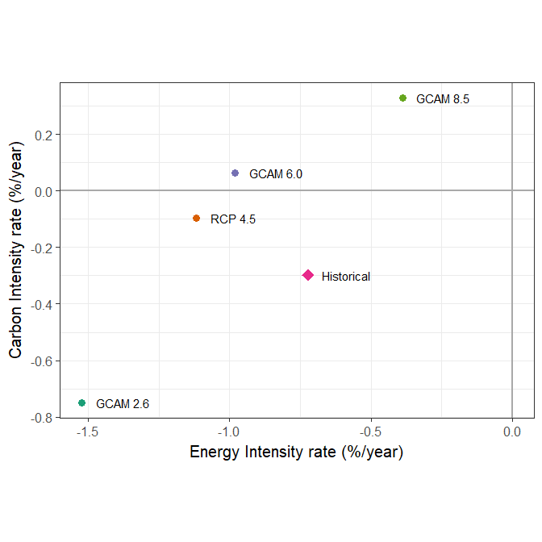

Introduction
============

This analysis follows the methods of Roger Pielke, Jr., Tom Wigley, and
Christopher Green, “Dangerous Assumptions,” *Nature* **452**, 531 (2008)
<https://www-nature-com/articles/452531a> and Samantha Stevenson and
Roger Pielke, Jr., “Assumptions of Spontaneous Decarbonization in the
IPCC AR5 Baseline Scenarios,”
<https://pdfs.semanticscholar.org/0aef/69f0117b6f4e1d2926e1acaa6db7af963924.pdf>

However, in the previous work, the observed historical trend was taken
from 2000–2005 and 2000–2008, respectively, which may not be the best
choice. World carbon intensity steadily declined from 1965–2000 and then
suddenly jumped from around 2000–2007 and then began to fall again:

``` r
get_kaya_data("World") %>% 
  plot_kaya("f", y_lab = expression(paste(MMT * CO[2] / quad)), log_scale = TRUE,
            start_year = 2000, stop_year = 2008) +
  labs(title = "Carbon intensity of world energy supply") +
  scale_y_log10(breaks = seq(62, 78, 4))
```


Thus, taking the observed trend from 2005–2016 both better matches the
period in which we are calculating implied decarbonization trends for
the first 15 years of the RCP scenarios and also is more comparable to
the broader historical trend.

Methods
=======

To calculate carbon intensity and energy intensity, we need economic
data for the scenarios, so to make things simple, we use the GCAM
simulations of the RCPs (<http://www.globalchange.umd.edu/gcamrcp/>,
with the data file
<http://www.globalchange.umd.edu/data/rcp/GCAMRCPData.xls>). These are
not identical to the official RCP data, but present reasonable scenarios
that produce very close to the same emissions pathways, calculated
within a consistent macroeconomic model of regional economies and energy
use.

Read GCAM Scenarios
-------------------

First, we read in the GCAM scenarios from the file `GCAMRCPData.xls`:

``` r
data_dir <- 'data'
data_file <- file.path(data_dir, 'GCAMRCPData.xls')

rcp_45   <- read_excel(data_file, 'RCP4.5') %>% clean_names()
gcam_60  <- read_excel(data_file, 'GCAM6.0') %>% clean_names()
gcam_85  <- read_excel(data_file, 'GCAM8.5') %>% clean_names()
gcam_26  <- read_excel(data_file, 'GCAM2.6') %>% clean_names()
gcam_ref <- read_excel(data_file, 'GCAMReference') %>% clean_names()
gcam_by_sector <- read_excel(data_file, 'CO2EmissionsbySector') %>% clean_names()

#
# Clean up a list of variables by converting them into legal names
#
clean_vars <- function(vv) {
  new_vv <- vv %>% 
    str_replace_all(c("['\"]" = "", "%" = "percent", "^[ ]+" = "_")) %>%
    make.names() %>%
    str_replace_all(c("[._]+" = "_", "_+$" = "")) %>% str_to_lower()
}

#
# The excel sheet runs years in columns and variables in rows.
# Flip this to put years in columns (and we need to fix "x2008" type col names
# and convert years to integers), and clean up variable names to make them
# legal column names.
#
process_scenario <- function(df) {
  df %>% gather(key = "year", value = "value", -model, -scenario, -region, -variable, -unit) %>%
    mutate(year = str_replace_all(year, "^[^0-9]+", "") %>% as.integer()) %>%
    mutate(variable = clean_vars(variable))
}

for(s in c('gcam_26', 'rcp_45', 'gcam_60', 'gcam_85', 'gcam_ref', 'gcam_by_sector')) {
  get(s) %>% process_scenario() %>% assign(x = s, value = ., pos = globalenv())
}

all_scenarios <- rbind(gcam_26, rcp_45, gcam_60, gcam_85)

#
# There are lots of variables. We're interested in the Kaya ones, so filter
# those out, and change the names to the ones we want.
# Change scenario names to what we want.
# Then add up values for each region to get whole world numbers.
#
gcam_scenarios <- all_scenarios %>%
  filter(variable %in% c("population_total", "gdp_total_mer", "primary_energy_total",
                         "emissions_co2_fossil_fuels_and_industry")) %>%
  select(scenario, region, variable, year, value) %>%
  mutate(variable = str_replace_all(variable, c("_.*$" = "", "^population" = "P",
                                                "^gdp" = "G", "^primary" = "E",
                                                "^emissions" = "F")),
         scenario = str_replace_all(scenario, "(GCAM|RCP)([0-9])", "\\1 \\2")) %>%
  group_by(scenario, variable, year) %>% summarize(value = sum(value)) %>% ungroup()
```

Observed Historical Data
------------------------

We get historical emissions data from the 2017 BP Statisical Review of
World Energy and historical economic data from the World Bank. For
convenience, we have already calculated these in the `kayadata` package,
so we use that.

``` r
historical <- get_kaya_data("World")
```

Calculate Decarbonization Rates
-------------------------------

From the Kaya identity, the energy intensity of the economy is given by
*e* = *E*/*G*, and the carbon intensity of the energy supply is given by
*f* = *F*/*E*, where *E* is the total primary energy consumption, *F* is
the total carbon dioxide emissions, and *G* is the gross world product.

Fractional growth rates are given by
$$
\\begin{align\*}
r\_e &= \\frac{\\text{d} \\ln e}{\\text{d}t} \\\\
r\_f &= \\frac{\\text{d} \\ln f}{\\text{d}t}
\\end{align\*}
$$

We implied rates under RCP and GCAM scenarios from 2005–2020 and we
calculate rates of observed (historical) change from 2005–2016.

``` r
rates <- gcam_scenarios %>% spread(key = variable, value = value) %>%
  mutate(e = E / G, f = F / E) %>% select(year, scenario, e, f) %>%
  filter(year >= 2005, year <= 2020) %>% gather(key = variable, value = value, e, f) %>%
  nest(-scenario, -variable) %>% group_by(scenario, variable) %>%
  mutate(fit = map(data, ~lm(log(value) ~ year, data = .x))) %>%
  mutate(coefs = map(fit, coef)) %>% mutate(rate = map_dbl(coefs, 2)) %>%
  ungroup() %>%
  select(scenario, variable, rate) %>% mutate(variable = str_c("r.", variable)) %>%
  spread(key = variable, value = rate)

hist_rates <- historical %>% select(year, e, f) %>% filter(year >= 2005) %>%
  gather(key = variable, value = value, -year) %>%
  nest(-variable) %>% group_by(variable) %>%
  mutate(fit = map(data, ~lm(log(value) ~ year, data = .x))) %>%
  mutate(coefs = map(fit, coef)) %>% mutate(rate = map_dbl(coefs, 2)) %>%
  ungroup() %>%
  select(variable, rate) %>% mutate(variable = str_c("r.", variable)) %>%
  spread(key = variable, value = rate) %>% mutate(scenario = "Historical")

rates <- rates %>% bind_rows(hist_rates)
```

Analysis
========

Now we have the data, so we plot the implied rates of decarbonization in
the RCP and GCAM scenarios and compare them to the observed historical
rates over the same time frame.

``` r
rcp_scales <- tribble(
  ~scenario, ~order, ~break_order, ~shape, ~size,
  "Historical", 2, 1, 18, 5,
  "GCAM 8.5",   1, 2, 16, 3,
  "GCAM 6.0",   3, 3, 16, 3,
  "RCP 4.5",    4, 4, 16, 3,
  "GCAM 2.6",   5, 5, 16, 3
  ) %>% arrange(order) %>% mutate(scenario = factor(scenario))
  

rcp_levels <- rcp_scales %>% arrange(order) %>% select(scenario) %>% simplify() %>% unname()
rcp_breaks <- rcp_scales %>% arrange(break_order) %>% select(scenario) %>% simplify() %>% unname()
rcp_shapes <- rcp_scales %>% arrange(order) %>% select(scenario, shape) %>% 
  spread(key = scenario, value = shape) %>% simplify()
rcp_sizes  <- rcp_scales %>% arrange(order) %>% select(scenario, size) %>% 
  spread(key = scenario, value = size) %>% simplify()

rate_plot <- rates %>%
  mutate(scenario = ordered(scenario, levels = rcp_levels)) %>%
  ggplot(aes(x = 100 * r.e, y = 100 * r.f, color = scenario, shape = scenario, 
             size = scenario)) +
  geom_hline(size = 1, color = "dark gray", yintercept = 0.0) +
  geom_vline(size = 1, color = "dark gray", xintercept = 0.0) +
  geom_point() +
  geom_text(aes(label = scenario), color = "black", size = 4, check_overlap = TRUE, 
            hjust = 0, nudge_x = 0.05) +
  labs(x = "Energy Intensity rate (%/year)", y = "Carbon Intensity rate (%/year)")  +
  scale_color_brewer(palette = "Dark2", breaks = rcp_breaks, direction = -1, 
                     name = "Scenario", guide = "none") +
  scale_shape_manual(values = rcp_shapes, breaks = rcp_breaks, name = "Scenario", 
                     guide = "none") +
  scale_size_manual(values = rcp_sizes, breaks = rcp_breaks, name = "Scenario", 
                    guide = "none") +
  coord_fixed(ratio = 1) +
  theme_bw(base_size = 15)

print(rate_plot)
```


